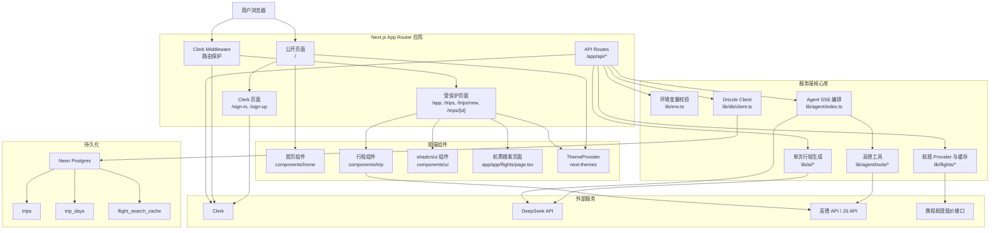
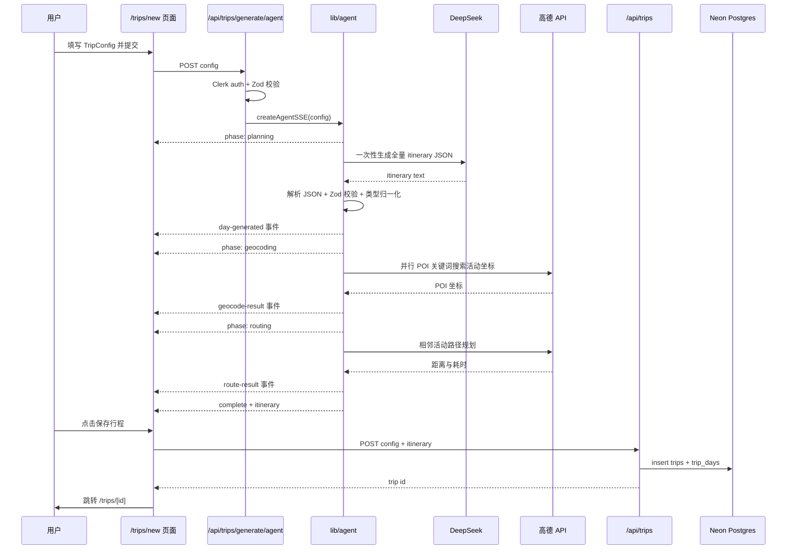
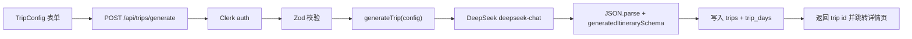
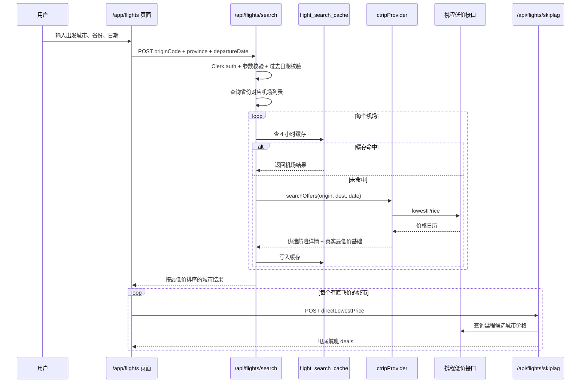
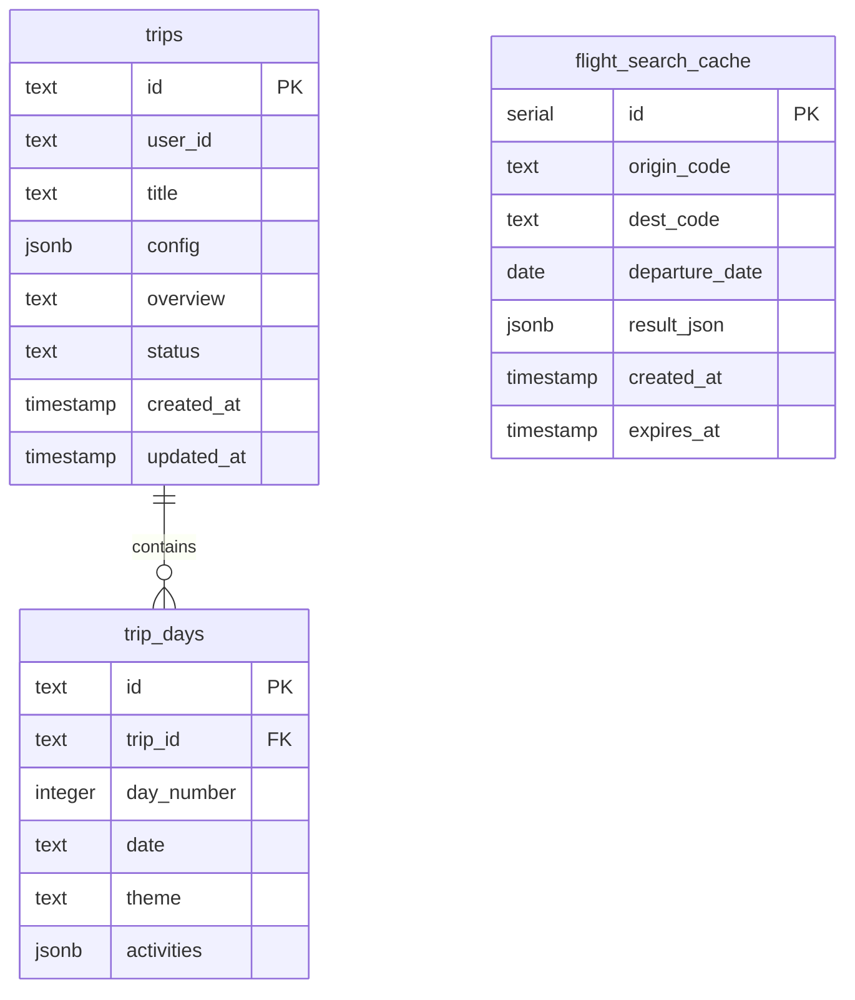

# travel-private 项目架构说明

**日期:** 2026-07-03  
**范围:** 基于当前源码、`README.md` 和 `openspec/specs/` 的实现现状分析。本文不定义新需求，只记录当前系统架构与主要数据流。

## 1. 项目定位

`travel-private` 是一个私有旅行规划学习项目，当前已经从最初的脚手架演进为一个基于 Next.js App Router 的旅行工具应用。核心能力包括：

- 公开首页、Clerk 登录/注册与受保护工作区。
- AI 行程规划：用户输入目的地、日期、预算、人数和出行模式后，系统生成结构化每日行程。
- Agent 式行程规划：通过 SSE 分阶段返回规划、地理编码、路线计算和最终行程。
- 行程列表与详情页：按用户隔离存储行程，并在详情页结合高德地图展示路线和地点。
- 机票搜索：按省份搜索机场直飞机票，并异步发现潜在甩尾航班。

当前 `openspec/project.md` 仍停留在早期“栈未定”描述，和实际代码存在偏差；更准确的事实来源是 `README.md`、`package.json`、`openspec/specs/` 与源码。

## 2. 技术栈

| 层次 | 当前选择 | 主要位置 |
| --- | --- | --- |
| Web 框架 | Next.js 16 App Router、React 19、TypeScript | `app/` |
| 样式与 UI | Tailwind CSS 4、shadcn/ui、lucide-react、next-themes | `app/globals.css`, `components/ui/`, `components/home/`, `components/trip/` |
| 认证 | Clerk | `app/layout.tsx`, `middleware.ts`, `app/(clerk)/` |
| 数据库 | Neon Postgres + Drizzle ORM | `lib/db/`, `db/schema/`, `db/migrations/` |
| AI | Vercel AI SDK + DeepSeek OpenAI-compatible endpoint | `lib/ai/`, `lib/agent/` |
| 地图与地点 | 高德 Web API / JS API | `components/trip/trip-map.tsx`, `lib/agent/tools/`, `app/api/amap/` |
| 航班 | 携程低价接口 + 本地机场/城市映射 | `lib/flights/`, `app/api/flights/` |
| 校验 | Zod | `lib/env.ts`, API routes, `lib/ai/schemas.ts` |
| 测试 | Vitest | `vitest.config.ts`, `lib/agent/tools/__tests__/` |

## 3. 总体架构图

## 4. 路由与页面结构

| 路由 | 说明 | 关键文件 |
| --- | --- | --- |
| `/` | 公开首页，包含导航栏、Hero 和页脚 | `app/page.tsx`, `components/home/*` |
| `/sign-in`, `/sign-up` | Clerk 托管认证页面 | `app/(clerk)/sign-in/[[...rest]]/page.tsx`, `app/(clerk)/sign-up/[[...rest]]/page.tsx` |
| `/app` | 登录后的基础工作区占位页 | `app/app/page.tsx` |
| `/app/flights` | 机票搜索与甩尾航班发现 | `app/app/flights/page.tsx` |
| `/trips` | 当前用户行程列表 | `app/trips/page.tsx` |
| `/trips/new` | 新建行程：左侧表单/进度/预览，右侧地图 | `app/trips/new/page.tsx` |
| `/trips/[id]` | 只读行程详情：左侧行程，右侧地图 | `app/trips/[id]/page.tsx` |

`middleware.ts` 目前保护 `/app(.*)` 和 `/trips(.*)`，API routes 自身也通过 `auth()` 做鉴权。

## 5. 核心 API

| API | 方法 | 用途 |
| --- | --- | --- |
| `/api/trips` | `GET` | 获取当前用户所有行程，按 `updatedAt` 倒序 |
| `/api/trips` | `POST` | 保存前端预览中的 Agent 行程到数据库 |
| `/api/trips/[id]` | `GET` | 获取某个当前用户行程和每日活动 |
| `/api/trips/[id]` | `PUT` | 覆盖保存行程概览和每日活动 |
| `/api/trips/[id]` | `DELETE` | 删除当前用户行程，级联删除天数 |
| `/api/trips/generate` | `POST` | 传统单次 DeepSeek 生成并自动入库 |
| `/api/trips/generate/agent` | `POST` | Agent SSE 生成，不直接入库，用户确认后保存 |
| `/api/amap/place-detail` | `GET` | 按关键词调用高德搜索和详情接口，返回地点详情 |
| `/api/flights/search` | `POST` | 按省份搜索目标省内机场航班，支持缓存 |
| `/api/flights/skiplag` | `POST` | 根据直飞最低价扫描潜在甩尾航班 |

## 6. 行程生成链路

### 6.1 Agent SSE 链路

该链路的特点是“先规划，再补真实地点坐标，再计算相邻活动交通”。数据库写入发生在用户确认保存之后，因此生成失败或用户取消不会留下半成品记录。

### 6.2 传统单次生成链路

传统链路保留为 fallback。它直接调用 DeepSeek 生成结构化 JSON，并在服务端自动写入数据库。

## 7. 机票搜索链路

机票模块当前使用携程低价日历作为价格来源，再用确定性伪随机方式生成航司、航班号和时间等展示字段。缓存表的 TTL 是 4 小时。

## 8. 数据模型

`trips.config` 存储 `TripConfig`，`trip_days.activities` 存储 `PlannedActivity[]`。这让行程结构演进比较灵活，但也意味着查询粒度主要停留在整行程/整天级别，无法轻易用 SQL 查询单个活动。

## 9. 模块边界

| 模块 | 职责 | 依赖 |
| --- | --- | --- |
| `app/` | 页面、布局、API route handler | Clerk、组件、`lib/*` |
| `components/home/` | 首页展示与导航 | Clerk 前端组件、next-themes |
| `components/trip/` | 行程表单、进度、卡片、地图、地点详情 | 高德 JS API、API routes、行程类型 |
| `components/ui/` | shadcn/ui 通用组件 | Tailwind、Radix/Base UI 风格依赖 |
| `lib/env.ts` | 启动时 fail-fast 校验环境变量 | Zod |
| `lib/db/` | 单一 Drizzle 实例 | Neon、Drizzle、schema |
| `db/schema/` | 表定义与迁移源 | Drizzle |
| `lib/ai/` | 传统 AI 生成、DeepSeek provider、prompt/schema | Vercel AI SDK、Zod |
| `lib/agent/` | Agent SSE 编排、事件协议、工具调用 | DeepSeek、高德工具、行程 schema |
| `lib/flights/` | 航班 provider、机场数据、缓存 | 携程接口、Drizzle |
| `openspec/` | 需求与变更流程事实来源 | 人工维护 |

## 10. 配置与环境变量

`lib/env.ts` 负责强制校验：

- `DATABASE_URL`
- `NEXT_PUBLIC_CLERK_PUBLISHABLE_KEY`
- `CLERK_SECRET_KEY`
- `NEXT_PUBLIC_CLERK_SIGN_IN_URL`
- `NEXT_PUBLIC_CLERK_SIGN_UP_URL`
- `NEXT_PUBLIC_CLERK_AFTER_SIGN_IN_URL`
- `NEXT_PUBLIC_CLERK_AFTER_SIGN_UP_URL`
- `DEEPSEEK_API_KEY`
- 可选：`AMADEUS_API_KEY`, `AMADEUS_API_SECRET`

代码中还直接读取 `NEXT_PUBLIC_AMAP_WEB_KEY`，但它没有进入 `envSchema` 的必填项。高德能力依赖该 key；如果缺失，相关前端联想、地图、地点详情和 Agent 工具会退化或失败。

## 11. 当前值得关注的问题

1. **项目元信息滞后。** `openspec/project.md` 仍写着“栈未定”，建议后续通过一个文档同步型 change 更新项目上下文。
2. **Agent spec 与实现不完全一致。** `agent-trip-planner` spec 描述的是 ReAct 多工具循环；当前实现更接近“plan-first-then-enrich”：LLM 一次性生成全量行程，然后批量高德补坐标和路线。
3. **高德 key 未纳入 env fail-fast。** `NEXT_PUBLIC_AMAP_WEB_KEY` 是实际必需配置，但 `lib/env.ts` 未校验。
4. **API route 导入不一致。** 多数地方直接从 `@/lib/db/client` 导入 `db`，而 data-layer spec 希望业务代码从 `lib/db` 的单一入口导入。
5. **航班 provider 命名和实际来源有偏差。** spec 中仍出现 Amadeus 描述，实际 `lib/flights/index.ts` 导出的是 `ctripProvider`。
6. **行程状态更新时间未更新。** `PUT /api/trips/[id]` 更新 `overview` 和 `status`，但没有显式刷新 `updatedAt`；列表倒序依赖 `updatedAt` 时可能看不到最近编辑。
7. **结构化数据多存在 JSONB。** 这适合快速演进，但会限制对活动、地点、标签等字段的查询和约束能力。

## 12. 推荐后续整理方向

- 用 OpenSpec 新增一个“project-context-sync”变更，更新 `openspec/project.md`、补齐高德 env 要求，并修正文档中 Amadeus/携程、ReAct/plan-first 的差异。
- 统一数据库入口为 `@/lib/db`，降低未来替换或增强 client 的成本。
- 把 Agent SSE 事件协议在文档中固化，方便前后端协作和测试。
- 为 `/api/trips/generate/agent`、`/api/flights/search` 增加更完整的集成或契约测试，覆盖鉴权、参数校验和外部服务失败。
- 如果后续需要地点收藏、按标签检索、地图聚合，考虑将活动地点从 `jsonb activities` 中拆为独立表。
